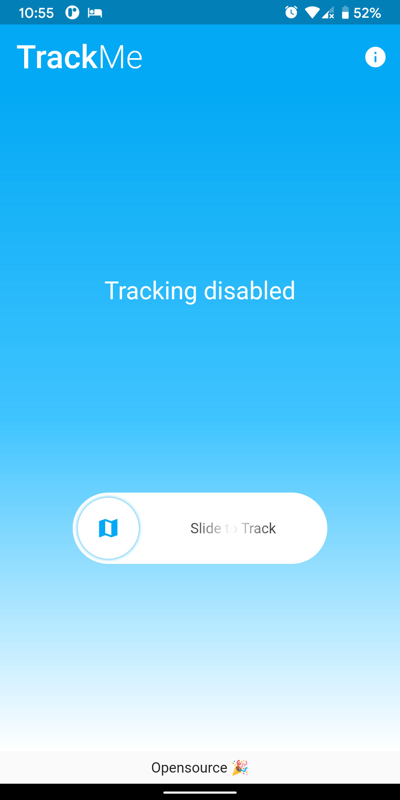

# TrackMe

Track your location and generate a summary in Google maps.



## Getting Started

This project is a starting point for learning to develop a Flutter application.
It's purely for educational purpose.

What can you learn? 
1. Flutter UI framework
2. Flutter architecture
3. Method channel
4. Background service
5. Foreground notification
6. SQLite database
7. async-await computation 
8. Location services
9. Google maps integration

## Setup

- Install Flutter
- Get Android Studio (or preferred editor)
- Open the project
- Connect your device (or start an emulator)
- Run!

## Instructions

##### Google Maps SDK
- Generate API key for Google Maps SDK (Android) in Cloud console.
- Add restrictions to the API key (Optional)
- Create `keys.xml` under `android/app/src/main/res/values`
- Put the API key under string resource name `maps_api_key`

##### Release configuration
- Follow instructions from [here](https://flutter.dev/docs/deployment/android#signing-the-app)

## Installation

##### Check installation
```shell script
flutter doctor
```

##### Run
```shell script
flutter run
```

##### Build APK
```shell script
flutter build apk
```
##### Build AppBundles
```shell script
flutter build appbundle
```

## License

Licensed under Apache License 2.0

Copyright 2020 Abarajithan

Licensed under the Apache License, Version 2.0 (the "License");
you may not use this file except in compliance with the License.
You may obtain a copy of the License at

   http://www.apache.org/licenses/LICENSE-2.0

Unless required by applicable law or agreed to in writing, software
distributed under the License is distributed on an "AS IS" BASIS,
WITHOUT WARRANTIES OR CONDITIONS OF ANY KIND, either express or implied.
See the License for the specific language governing permissions and
limitations under the License.
